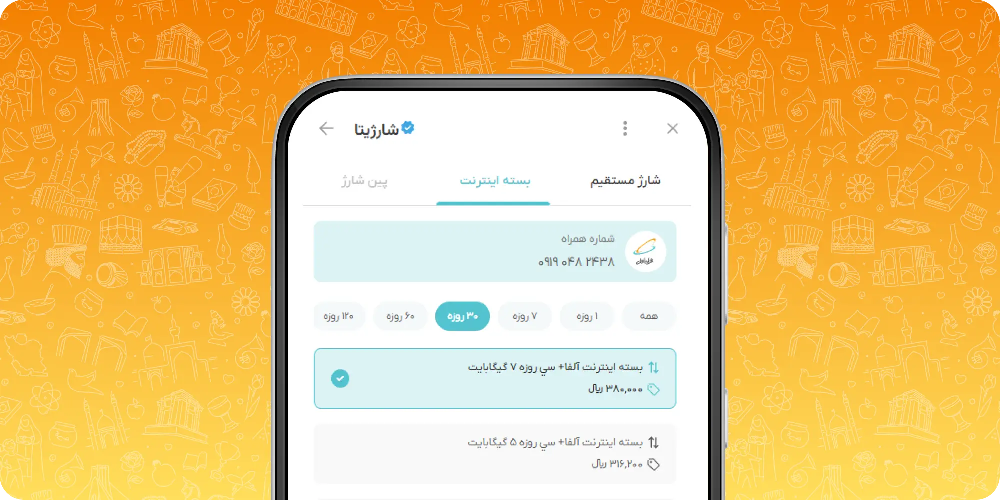

# چرا از برنامه استفاده کنیم؟

---

قابلیت **برنامه و برنامک** در پیام رسان ایتا، بستری قدرتمند برای اجرای اپلیکیشن‌های مبتنی بر وب فراهم می‌کند که می‌توانند به صورت مستقیم و بدون نیاز به نصب، درون پیام‌رسان اجرا شوند. این قابلیت، فرصتی نو برای کسب‌وکارها، سازمان‌ها و توسعه‌دهندگان فراهم کرده تا خدمات تعاملی خود را سریع‌تر و با تجربه کاربری بهتر به کاربران ارائه دهند.

برنامه و برنامک در ایتا از طریق یک WebView و یک **کیت توسعه  (SKD)** اجرا می‌شوند که امکان تعامل مستقیم اپلیکیشن شما با محیط پیام‌رسان را فراهم می‌کند.

## مزایای برنامه
---

### تجربه بی‌وقفه درون پیام‌رسان
کاربر بدون نیاز به خروج از پیام‌رسان، نصب اپلیکیشن یا مراجعه به مرورگر خارجی؛ می‌تواند با یک کلیک برنامه یا برنامک را باز کرده و از خدمات آن بهره‌مند شود. این تجربه روان باعث کاهش اصطکاک و افزایش نرخ تعامل می‌شود.

### امکان توسعه خدمات متنوع
با برنامه  می‌توان خدمات بسیار متنوعی را پیاده‌سازی کرد، از جمله:
- فرم‌های عضویت، ثبت‌نام، خرید و رزرو
- فروشگاه‌های آنلاین درون پیام‌رسان
- بازی‌های سبک تحت وب
- نظرسنجی‌ها و آزمون‌های تعاملی
- پنل‌های مدیریت کاربران، خدمات و محتوا

### دسترسی امن به اطلاعات کاربر
از طریق مکانیزم‌های احراز هویت امن، برنامه و برنامک می‌توانند اطلاعات کاربر (شامل شناسه کاربری، نام، زبان و تم برنامه ایتا) یا اطلاعات تماس او را (در صورت اجازه‌ی وی) دریافت کرده و تجربه‌ی شخصی‌سازی شده‌ای ارائه دهند.

### ارتباط دوطرفه با پیام‌رسان
برنامه یا برنامک شما می‌تواند از [SDK](https://blog.faradars.org/sdk-%DA%86%DB%8C%D8%B3%D8%AA/) و API های مخصوص ایتا برای انجام عملیات زیر استفاده کند:
- دریافت اطلاعات کاربر واردشده
- ارسال پیام به گفتگو
- دریافت شماره کاربر
- نمایش پنجره‌های هشدار یا تأیید به کاربر
- اضافه کردن برنامه به صفحه اصلی گوشی
- دسترسی به لرزش گوشی، QR Scanner ،Gyroscope ،Accelerometer و...

### توسعه آسان با فناوری‌های استاندارد وب
برای توسعه یک برنامه یا برنامک در ایتا، کافی‌ست از ابزارها و زبان‌های مرسوم دنیای وب مانند HTML، CSS و JavaScript استفاده کنید. می‌توانید با استفاده از فریمورک‌هایی مثل React، Vue، یا حتی jQuery، اپلیکیشن دلخواه خود را بسازید. **فقط کافیست [کیت توسعه ( SDK )](Develop/JsSDK) را به آن اضافه کنید.**

### بدون نیاز به انتشار در مارکت‌ها
برخلاف اپلیکیشن‌های موبایل که نیازمند طی مراحل طولانی انتشار در فروشگاه‌های اپلیکیشن هستند، برنامه و برنامک بلافاصله و پس از تأیید در ایتا قابل استفاده‌اند.

## نتیجه‌گیری

---

برنامه و برنامک راهکاری نوین برای ارائه خدمات سریع، ساده و مؤثر در بستر پیام‌رسان هستند. این مستند به شما کمک می‌کند تا از صفر تا صد طراحی، توسعه و انتشار برنامه و برنامک را در پلتفرم ایتا بیاموزید و اپلیکیشن‌های تعاملی خود را با کاربران در میان بگذارید.

